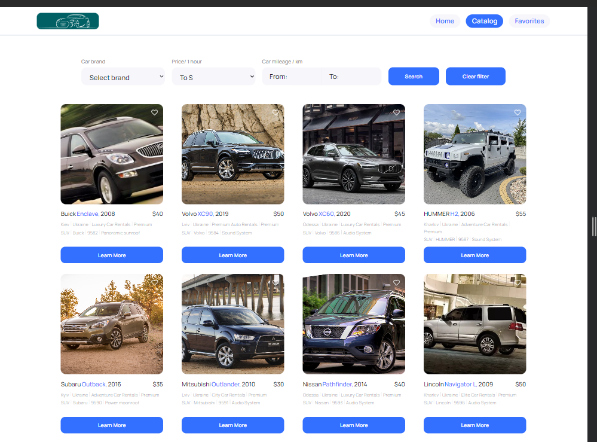
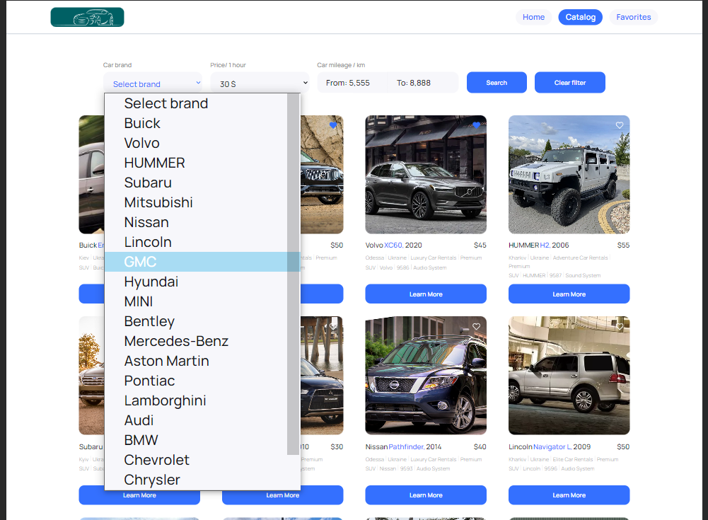
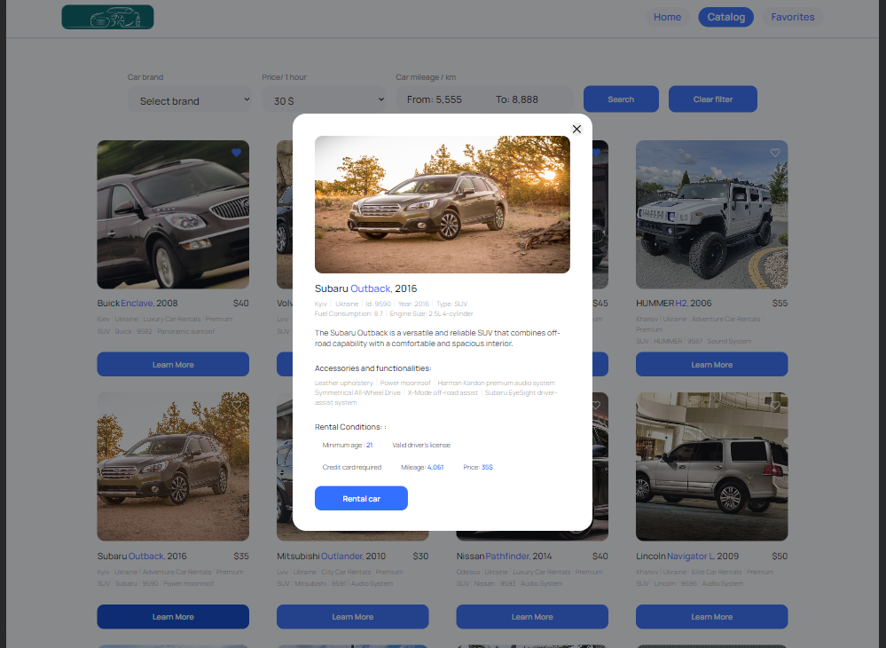
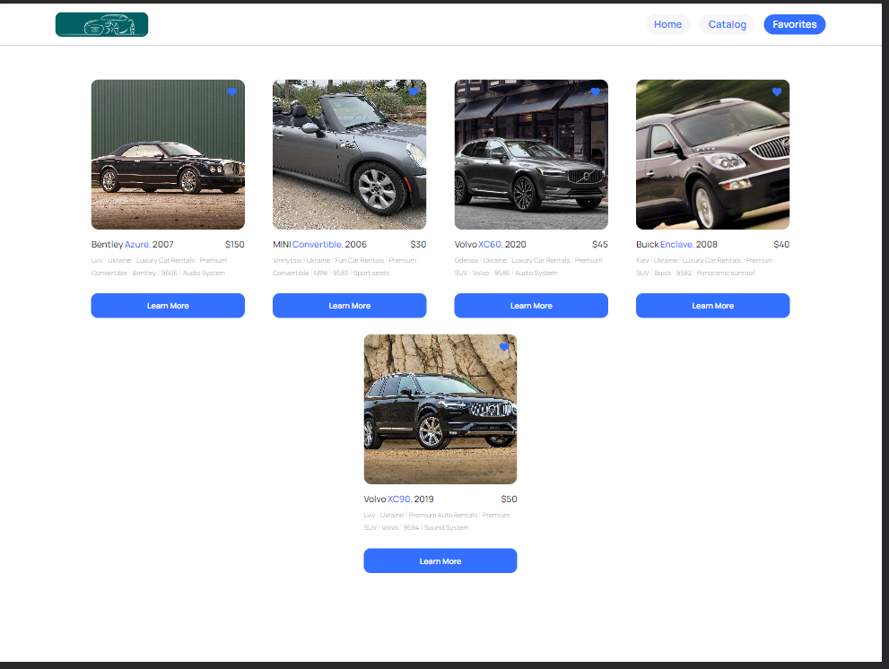

This project was created with
[Create React App](https://github.com/facebook/create-react-app).

# Web application Ukraine-AutoRental

Web application that provides car rental services in Ukraine.

## Technologies and frameworks used:

- React
- Redux Toolkit
- Redux-Persist
- Rect-router-dom
- Axios
- JavaScript
- MockAPI
- SCSS

## About project

The application consists of 3 pages:

- Home page;
- Catalog;
- Favorites;

1. Home page with a general description of services provided by the company and
   car brands

2. Catalog : Displays a catalog of cars with different specifications that users
   can filter by brand, hourly rental price, and mileage.

Here the user can :

    - add and remove cars from the favorites list.
    - view and filter car advertisements by brand, hourly rental price, and mileage.

    - view detailed information about a car and its rental conditions in a modal
    window.

3. Favorites: Shows cars added by the user to their favorites list.

## Technical functionality

- The application is built with React.
- Routing is implemented using React Router.
- Cars data is retrieved from a dedicated server created on MockAPI.
- If you click on the button in the form of a "heart" on the ad card, it should
  be added to the list of favorites, and the color of the button will change.
- If you click the heart button again, the ad is removed from the list of
  favorites, and the color of the button changes to its original state.
- If you click on the Learn more button, a modal window opens with detailed
  information about the car and its rental conditions
- Pagination is implemented on the Catalog page, with 12 advertisements per
  page.
- User actions are preserved even after page refresh.

## Live page

The live page can be accessed through the following link:
https://ihor-kutsenko.github.io/Ukraine-AutoRental
